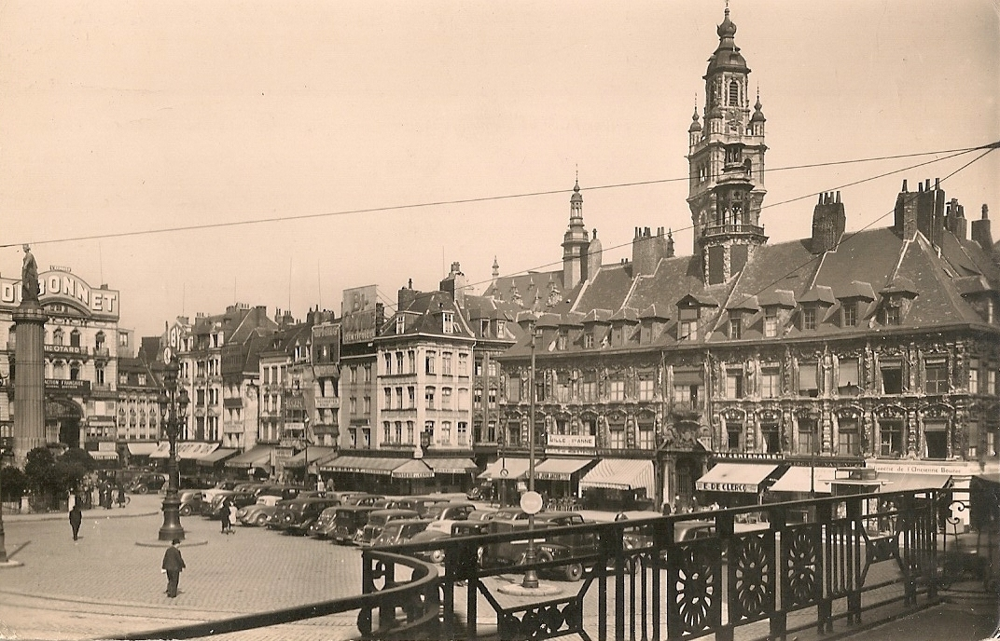
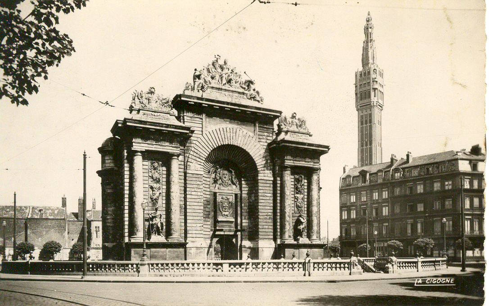

  <a href="/archives-famille/" style="text-decoration: none; color: #2e4a62; font-weight: bold;">← Accueil</a>

<h1 class="titre-ville">Collection : Lille</h1>

  

    
  

  

    
  

  

    
  

  

    
  

  

    
  

  

    
  

  

    
  

  

    
  

  

    
  

  

    
  

  

    
  

  <a class="bouton-prec" onclick="changerDiapo(-1)">&#10094;</a>
  <a class="bouton-suiv" onclick="changerDiapo(1)">&#10095;</a>
  
  <div style="margin-top:1
