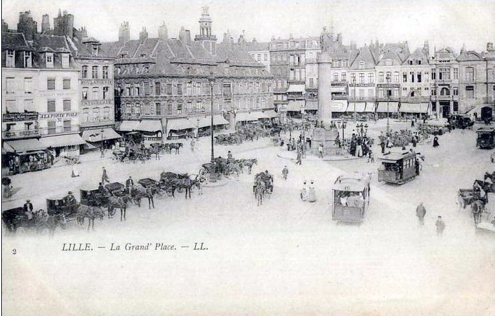
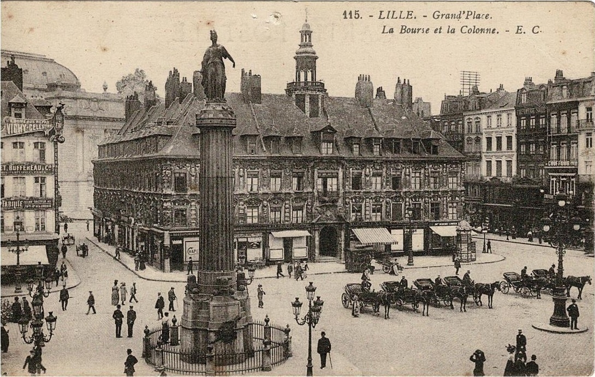
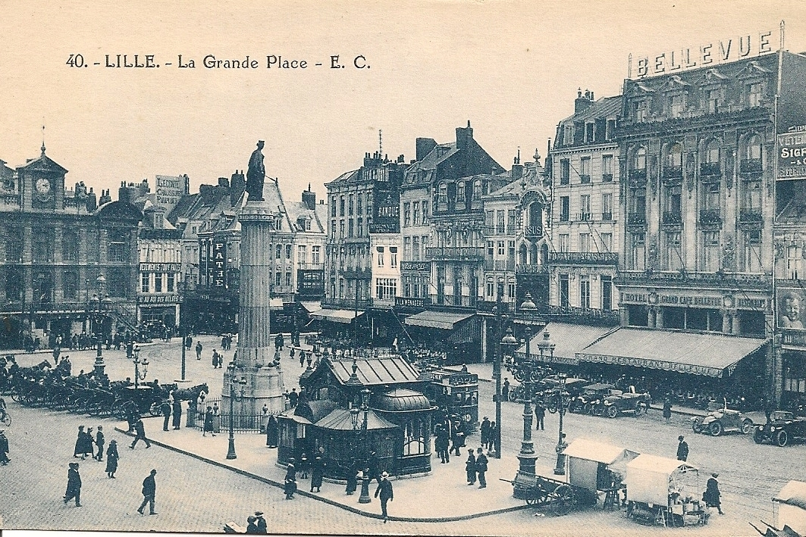
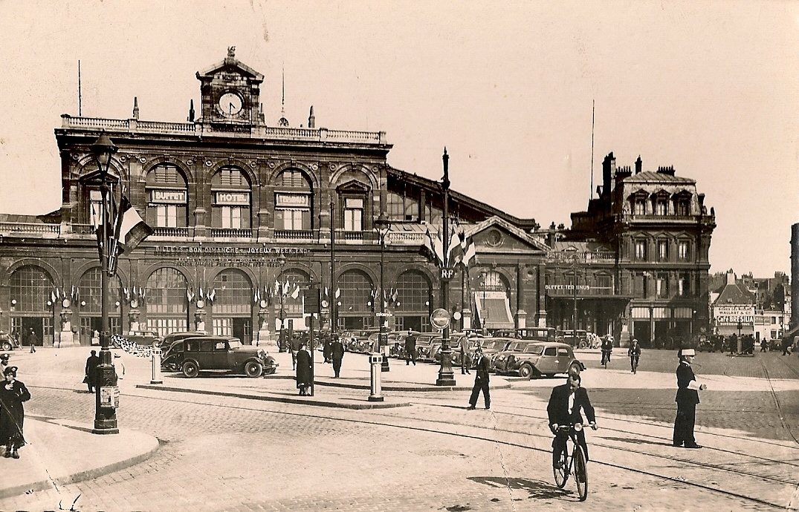
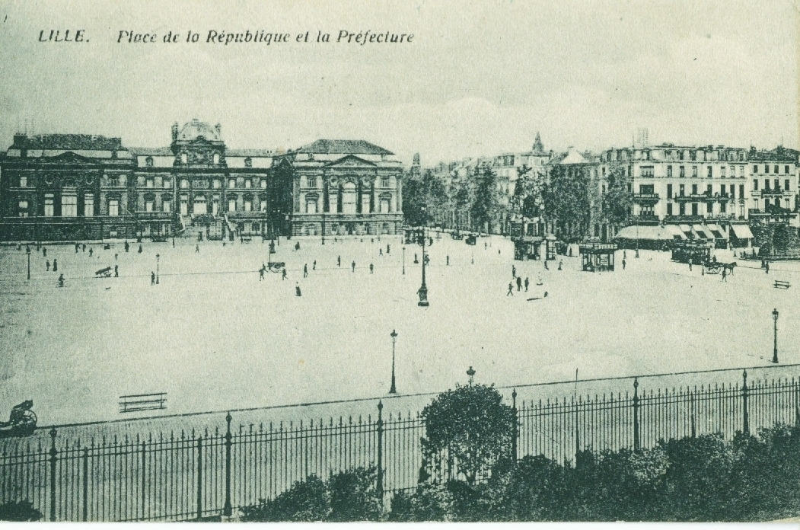
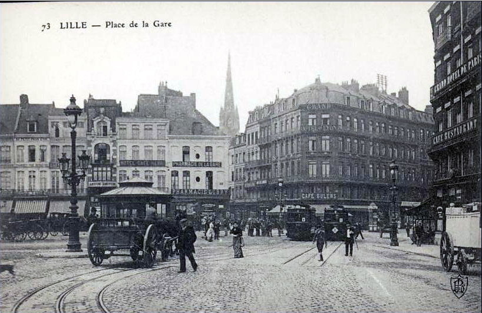
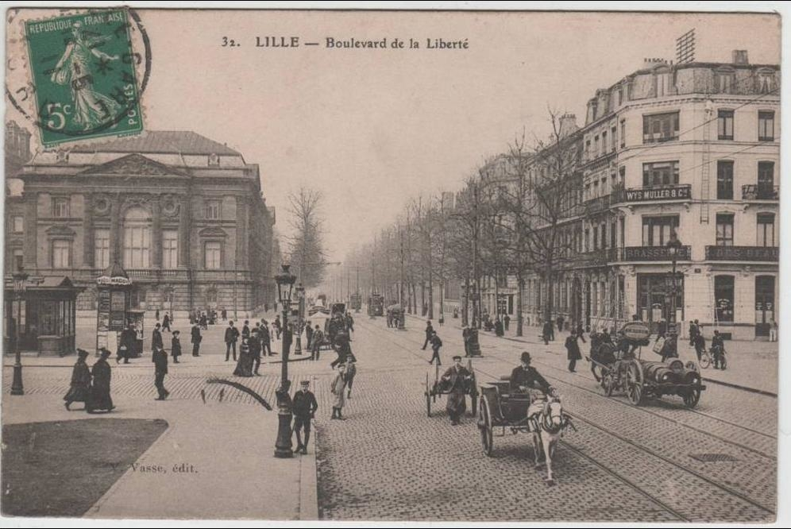
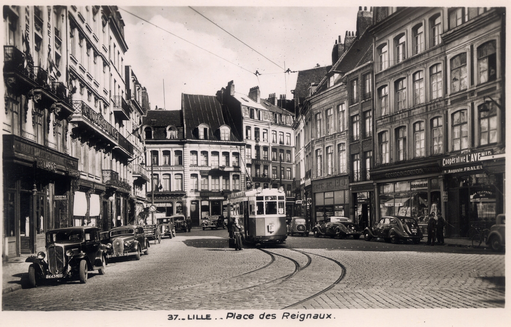
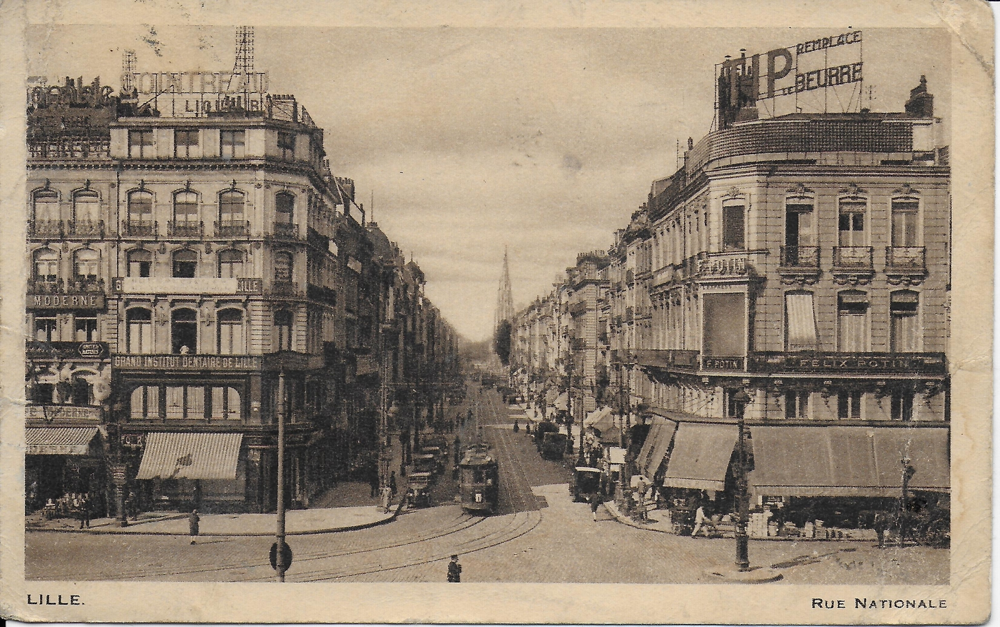

<link rel="stylesheet" type="text/css" href="https://cdn.jsdelivr.net/npm/slick-carousel@1.8.1/slick/slick.css"/>
<link rel="stylesheet" type="text/css" href="https://cdn.jsdelivr.net/npm/slick-carousel@1.8.1/slick/slick-theme.css"/>

  <a href="/archives-famille/" class="bouton-retour">← Retour à l'accueil</a>

<h1 class="titre-ville">Collection : Lille</h1>

  

    

    

    

    

    

    

    

    

    

    

    

  

