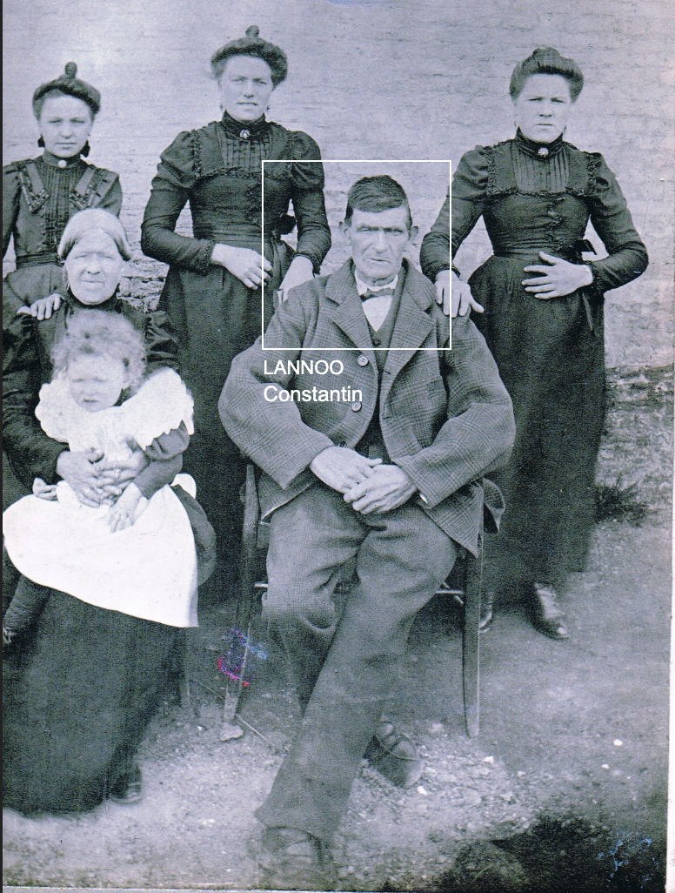
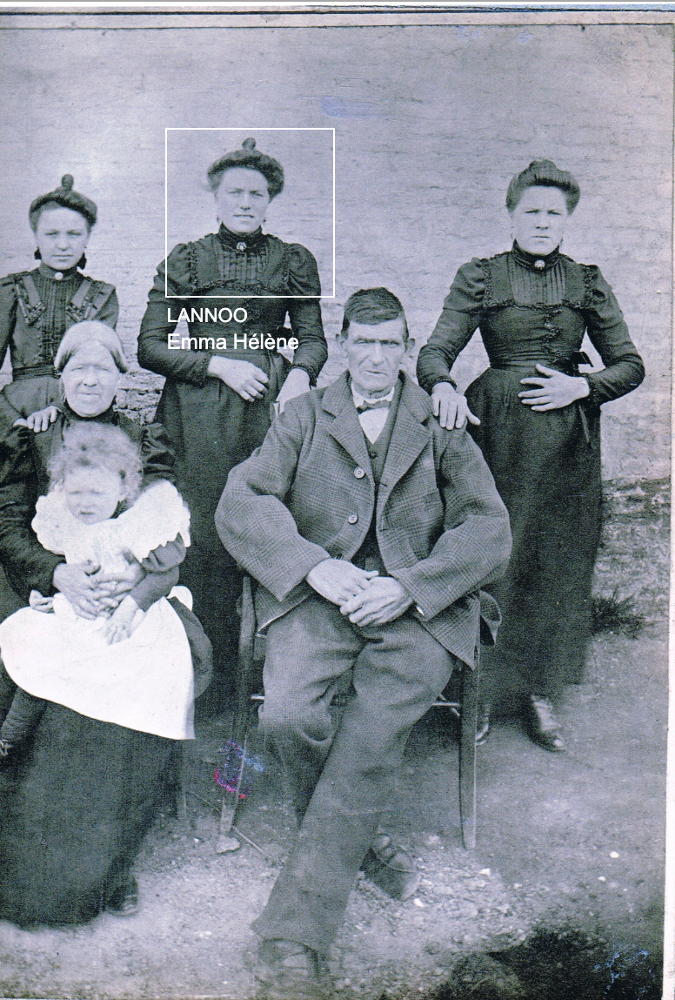
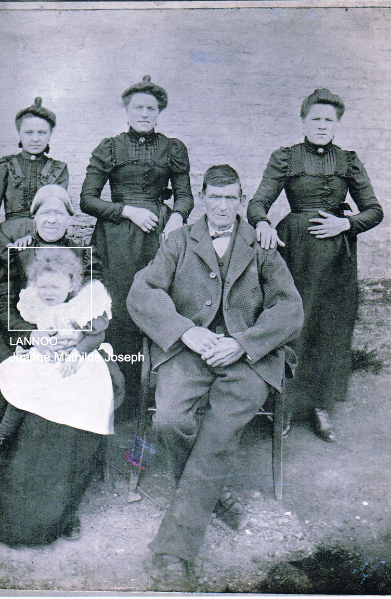
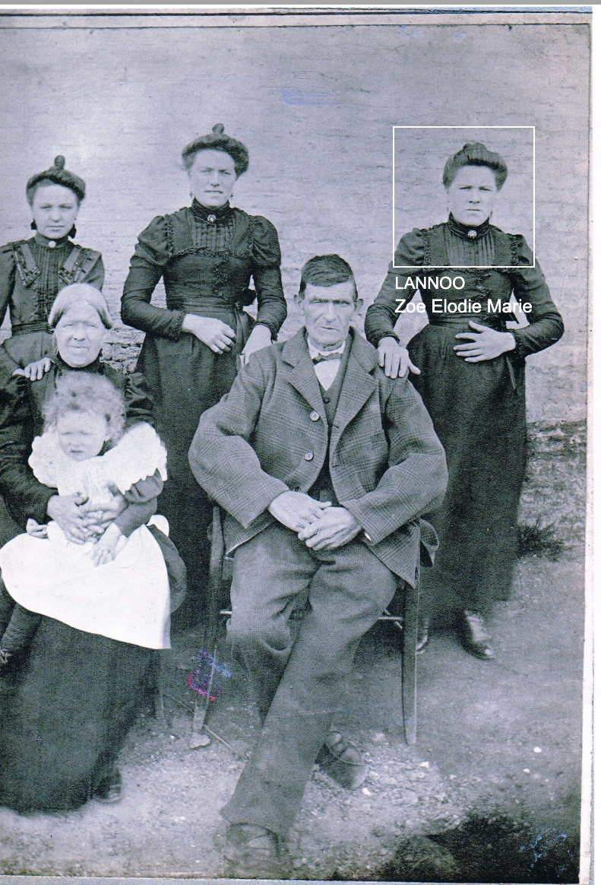
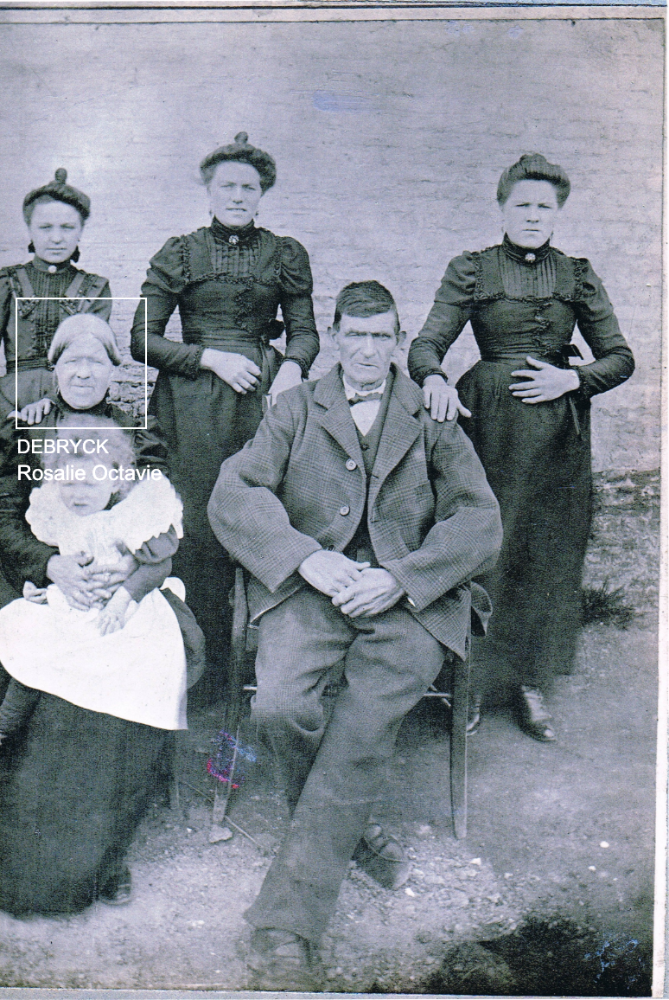

  <a href="/archives-famille/" class="btn-nav" style="text-decoration: none;">← Retour à l'accueil</a>

<h1 class="titre-ville">Famille Lieneson : Portraits</h1>

  

  

  

  

  

  

    <button class="btn-nav" onclick="changerDiapo(-1)">❮ Précédent</button>
    
      1 / 5
    
    <button class="btn-nav" onclick="changerDiapo(1)">Suivant ❯</button>
  

