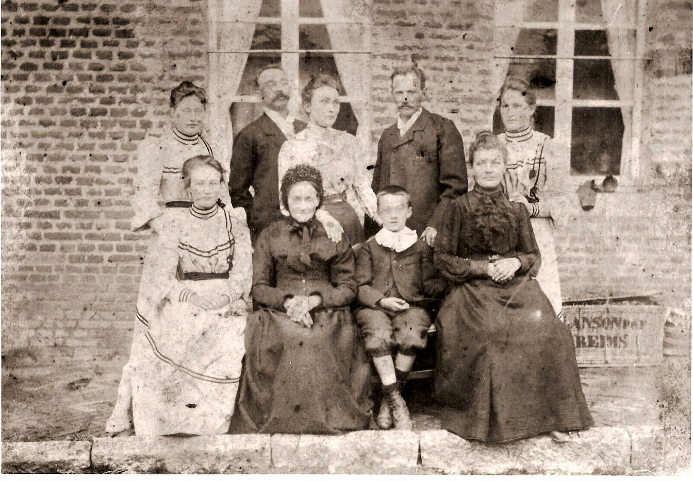

  
  

    <h1 class="mon-grand-titre">Archives Lieneson & Menet</h1>
    
Mémoire et Patrimoine Familial

  

  

  <ul class="custom-menu">
    <li><a href="/archives-famille/">ACCUEIL</a></li>
    <li><a href="#">FAMILLE LIENESON</a></li>
    <li><a href="#">FAMILLE MENET</a></li>
    <li>
      <a href="#">COLLECTION ▾</a>
      <ul class="submenu">
        <li><a href="/archives-famille/collection/lille/">Lille</a></li>
        <li><a href="/archives-famille/collection/reims/">Reims</a></li>
        <li><a href="/archives-famille/collection/mordelles/">Mordelles</a></li>
      </ul>
    </li>
  </ul>

  

Bienvenue sur mon site d'archives !
Ce projet est un portail documentaire d'archives familiales réalisé dans le cadre de ma formation (Licence professionnelle documentation). Il utilise Jekyll et des métadonnées structurées en YAML pour assurer l'interopérabilité des données.

