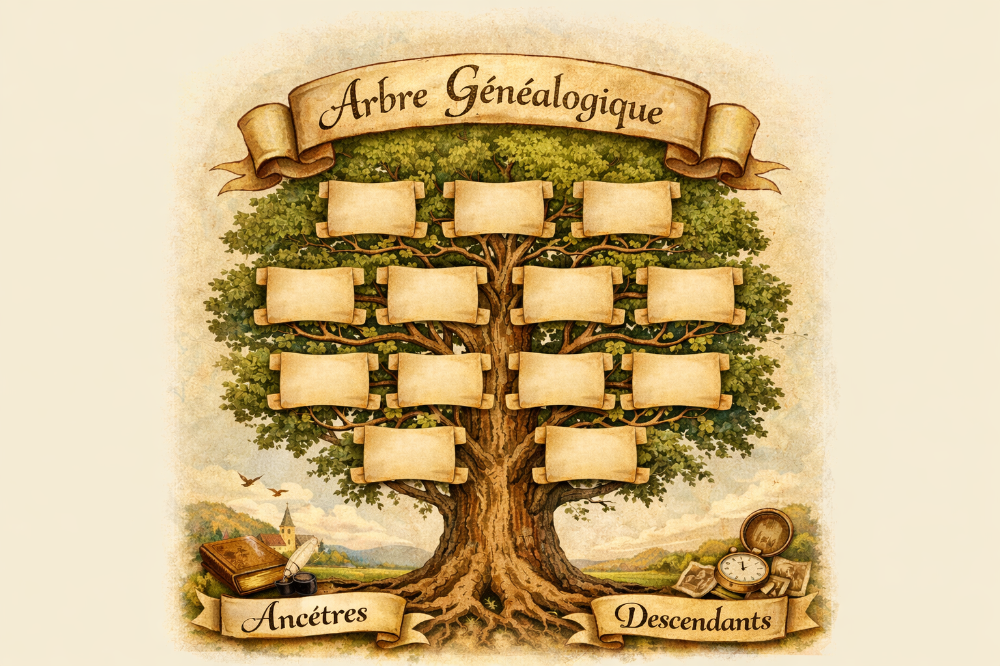

<nav class="custom-menu">
  <a href="/archives-famille/">Accueil</a>
  <a href="#">Famille Lieneson</a>
  <a href="#">Famille Menet</a>
  <a href="#">Collection</a>
</nav>

  
  

  

    <h1 style="color: #2e4a62; font-family: 'Apple Chancery', cursive, serif; font-size: 2.2em; margin: 0;">Archives Lieneson & Menet</h1>
    
Mémoire et Patrimoine Familial

  

  

  <h2 style="color: #2e4a62;">Portrait de Constantin Lannoo</h2>
  

